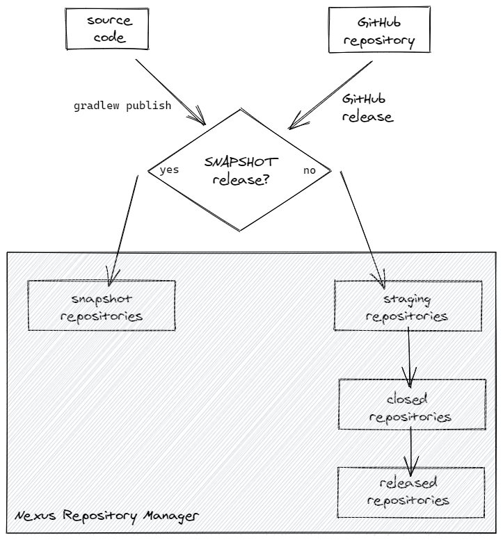
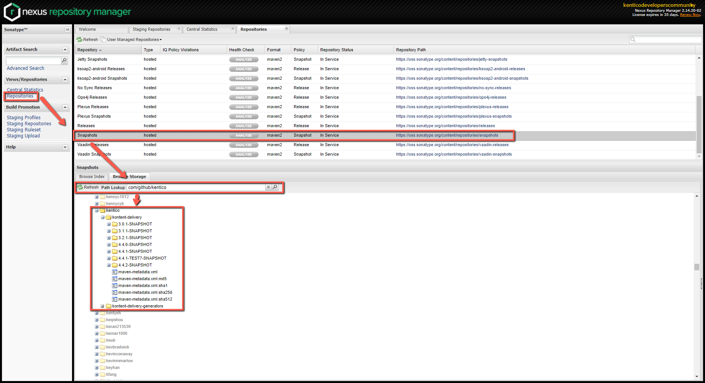
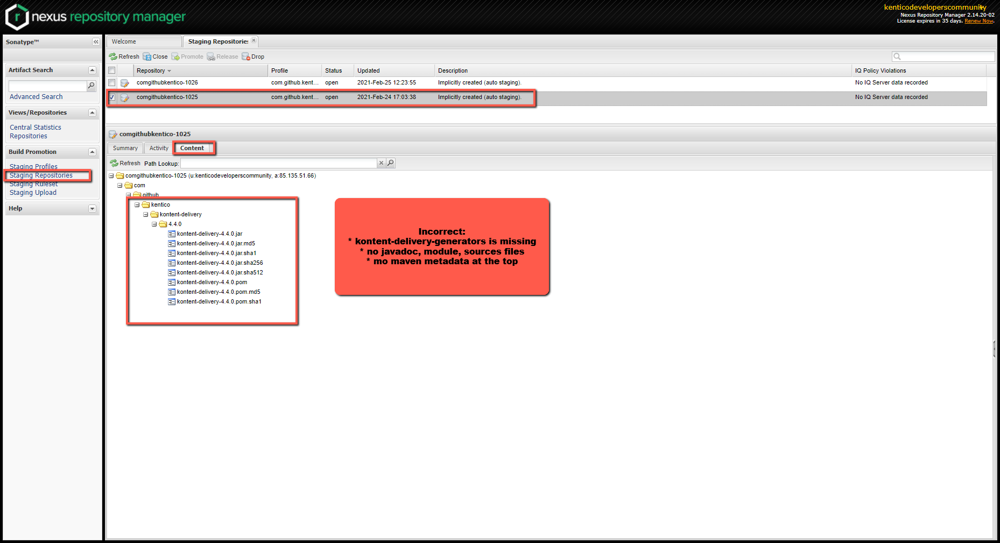
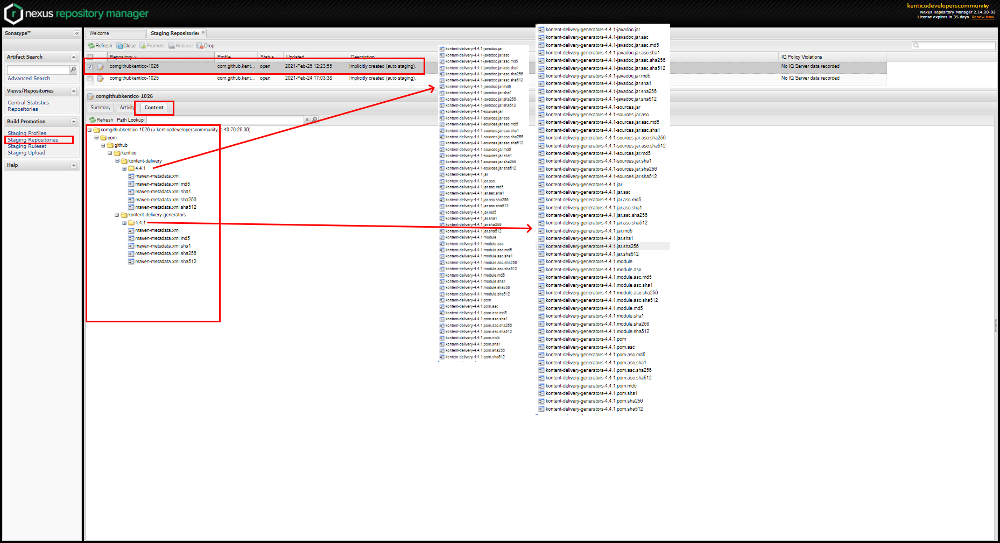
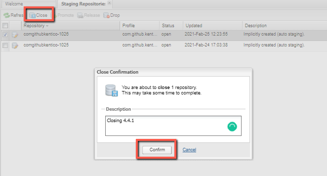
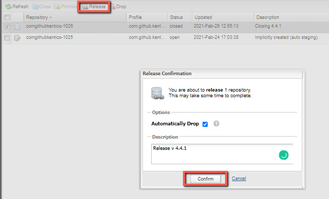

# Release process



## Credentials

> If you want to publish the new version, you need to have credentials for [Nexus Repository Manager](https://s01.oss.sonatype.org/) as well as GPG key information for signing the artifacts. All of these are stored in the password manager under the `Shared-DevRelExp` folder.

- _Shared-DevRelExp > Sonatype_service_account_ - [Nexus Repository Manager](https://s01.oss.sonatype.org/) credentials
- _Shared-DevRelExp > Kontent.ai  Master GPG_JAVA_SDK_MAVEN_ - GPG key used for artifacts signing

There are 5 keys for successful publishing and they can be provided via `local.properties` file, or via environment variables. This code is at the beginning of `/build.gradle` file.

> if you want to use `local.properties` file, copy `local.properties.template` file in this directory to `local.properties` (which will be ignored by Git).

| Key                 | local.properties property name | environment variable name |
| ------------------- | :----------------------------: | :-----------------------: |
| Ossrh Username      |        `ossrhUsername`         |     `OSSRH_USERNAME`      |
| Ossrh password      |        `ossrhPassword`         |     `OSSRH_PASSWORD`      |
| GPG Key ID          |         `signingKeyId`         |     `SIGNING_KEY_ID`      |
| GPG Private Key     |          `signingKey`          |       `SIGNING_KEY`       |
| GPG Password Phrase |       `signingPassword`        |    `SIGNING_PASSWORD`     |

> [!NOTE]
> If GPG keys are outdated, you need to generate them using GnuGP. Don't forget to publish the public key to repository (e.g. keys.ubuntu.com) so the Sonatype can verify the public key.

## Plugins

The release process is using the Gradle plugin [maven-publish](https://docs.gradle.org/current/userguide/publishing_maven.html) for creating the publication from the source code and the metadata and sends it to the [Nexus Repository Manager](https://s01.oss.sonatype.org/). The second Gradle plugin, [signing](https://docs.gradle.org/current/userguide/signing_plugin.html#signing_plugin), is responsible for signing the artifacts produced by the maven-publish plugin.

> maven-publish definition for kontent-delivery is stored in `/kontent-delivery/build.gradle` in `publishing` section

## Version specification

The version number is loaded at the bottom of the `/build.gradle` file. It is either loaded from the `RELEASE_TAG` environment variable (used for GitHub workflow release), or using hardcoded fallback (mostly for Manual release).

### Snapshot release - X.Y.Z-SNAPSHOT vs X.Y.Z

If you define tag name with "-SNAPSHOT" suffix i.e. `5.0.0-SNAPSHOT` artifact will be published to the `https://s01.oss.sonatype.org/content/repositories/snapshots/`, so that you could use it when you want to test out beta version release. The snapshot will be available, but not on from Maven Central repository, but from the staging endpoint:

```gradle
repositories {
   // typically you would use mavenCentral()
   maven { url 'https://s01.oss.sonatype.org/content/repositories/snapshots' }
}

dependencies {
  implementation 'ai.kontent:delivery-sdk:5.0.0-SNAPSHOT'
}
// ...
```

You could also list snapshots and browse snapshots in [Nexus Repository Manager](https://s01.oss.sonatype.org/)



### Final version

If you define tag name without "-SNAPSHOT" suffix i.e. `5.0.0` the artifact will be published among the staging repositories `https://s01.oss.sonatype.org/service/local/staging/deploy/maven2/`. You can check it and release it. In order to do that you need to follow these steps:

## Source code -> Nexus Repository Manager Staging Phase

### GitHub workflow Release

1. Verify that everything in the branch is ready to be published and the [build and tests](https://github.com/kontent-ai/java-packages/actions/workflows/gradle.yml) are passing.
1. Create a new GitHub release - **the tag name of the release will be used as a version**
   - Release creation triggers the [Publish Github workflow](https://github.com/kontent-ai/java-packages/actions/workflows/publish.yml) and creates a publish the artifacts to "Staging" repositories on Nexus repository manager.

### Manual Release

1. Copy the `local.properties.template` file in this directory to `local.properties` (which will be ignored by Git)).
1. Set each variable on `local.properties` from the password manager, or contact @kontent-ai/developer-relations team to get them.
1. Set the version you want to publish at the bottom of [`build.gradle`](./build.gradle).
1. (Optional - to run tests, etc.) Build the solution `./gradlew build`.
1. Run `./gradlew publish`.

> Artifacts are in staging phase on Nexus Repository Manager

## Nexus Repository Manager Staging Phase -> Maven Central

1. Check the content of the staging repository (_sometimes it takes a couple of minutes until the repository is visible in the Nexus Repository Manager UI_) that have been sent using [Github Workflow Release](#Github Workflow Release), or [Manual Release](#Manual-Release). It should contain these types of files:

   - Maven metadata files at the top
   - POM file
   - Sources jar
   - Javadoc jar
   - Module jar (not really necessary)
   - Released jar
   - hash files for all of above

   > Because of the buggy nature in the last bullet point, you will find some of them do not contain all these requirements. If none of them do (and you've been waiting for a reasonable amount of time after the build), your best bet is to trigger another release. It is fine to deploy from the staging repository as well as GitHub release and git tag if you were using [Github Workflow Release](#Github Workflow Release).

   - Incorrect
     
   - Correct
     

1. Once the content is OK, select "Staging Repositories" select the repository, and close it.

   

1. Select "Staging Repositories" select the repository and release it (_you need to wait a bit until the repository is successfully closed_).

   

1. Increase the patch version and append `-SNAPSHOT` at the bottom of `/build.gradle` file (i.e. `5.0.1-SNAPSHOT`) to be ready for the next development.

🎉Hooray - you have published a new version. 🚀 You could check it on:

- <https://repo1.maven.org/maven2/ai/kontent/delivery-sdk/>
- <https://repo1.maven.org/maven2/ai/kontent/delivery-sdk-generators/>
