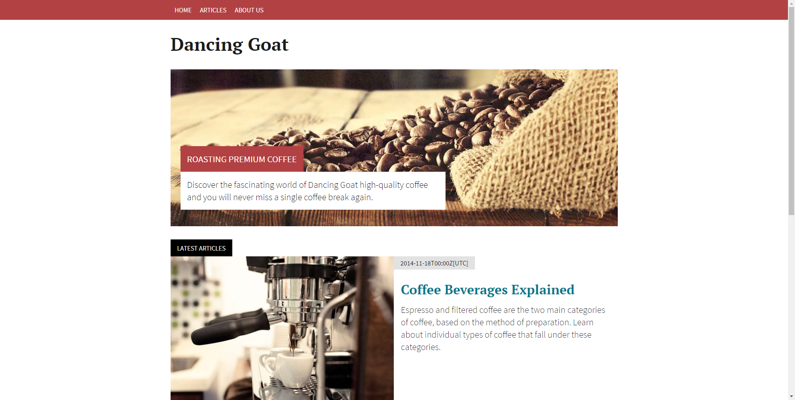
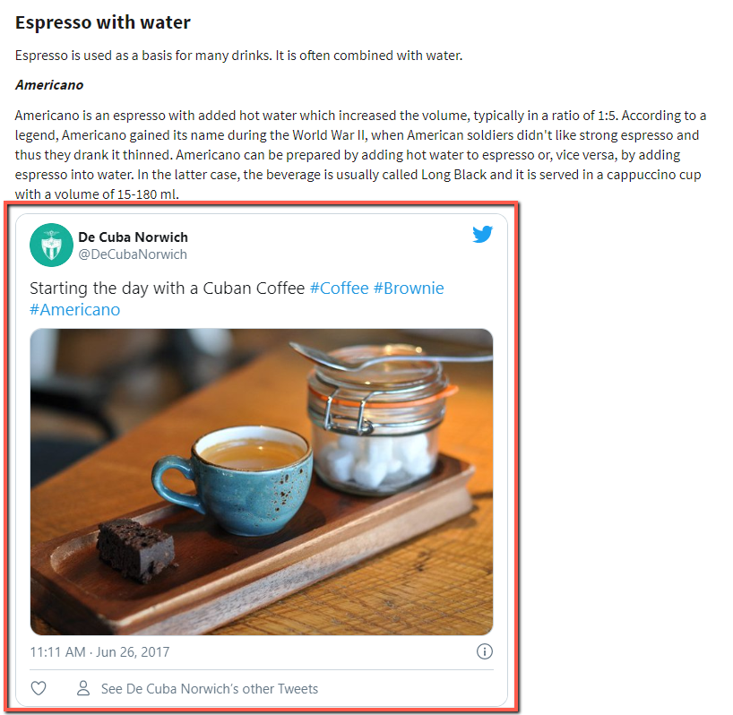

# Kontent Sample Spring Boot Console App

Showcase of the [Spring boot](https://spring.io/projects/spring-boot) application displaying data from Kontent.

## Get starred

First [build the whole monorepo](../README.md#Build-and-Test) and then run in the root of this repository:

```sh
./gradlew :sample-app-spring-boot:bootRun
```

Now visit <http://localhost:8080> and see a little subset of Dancing Goat!



## Features

### Generated strongly-typed models with view models transformation using Thymeleaf template engine

This showcase is using [model generator](../kontent-delivery-generators/README.md) for generating models. The models are generated in the [/src/main/java/kentico/kontent/delivery/sample/dancinggoat/models](./src/main/java/kentico/kontent/delivery/sample/dancinggoat/models) - this generation is configured to be run as a [gradle task](https://docs.gradle.org/current/dsl/org.gradle.api.Task.html) called [`generateModels`](./build.gradle#L48) as described in [model generators README](../kontent-delivery-generators/README.md#Run-as-a-gradle-task).

These models are then configured to be found in [KontentConfiguration.java](./src/main/java/kentico/kontent/delivery/sample/dancinggoat/springboot/KontentConfiguration.java#L18) by using `scanClasspathForMappings` method.

You could then use `DeliveryClient` to get strongly typed model as showcased in i.e. [`AboutUs` model](./src/main/java/kentico/kontent/delivery/sample/dancinggoat/models/AboutUs.java) in [`AboutUsController.java`](./src/main/java/kentico/kontent/delivery/sample/dancinggoat/controllers/AboutUsController.java#L21).

### Automatic rich text component resolution

SDK provides automatic resolution of the linked components and inline linked items in rich text. This could be showcased on <http://localhost:8080/articles/coffee-beverages-explained>.


The only thing to do it to create a display template named by the codename of the content type - [hosted_video.html](./src/main/resources/kentico/kontent/templates/hosted_video.html) in this case - and then just load strongly typed model in the controller ([`ArticleController.java`](./src/main/java/kentico/kontent/delivery/sample/dancinggoat/controllers/ArticleController.java#L37)) and that's it.

### Custom rich text component

If you wish to resolve the components/inline linked items in rich text.You could use `registerInlineContentItemsResolver` method as showcased in [KontentConfiguration.java](./src/main/java/kentico/kontent/delivery/sample/dancinggoat/springboot/KontentConfiguration.java#L21).



## How to connect to your own project

You could generate your own Sample project by using [Sample site configuration page](https://app.kontent.ai/sample-site-configuration) using "Create a new Sample Project" button.

Then use this project in the app:

1. In Kentico Kontent, choose Project settings from the app menu.
1. Under Development, choose API keys.
1. Copy your Project ID.
1. And then set the project ID to [KontentConfiguration.java](./src/main/java/kentico/kontent/delivery/sample/dancinggoat/springboot/KontentConfiguration.java#L17).
1.Then re-run the `./gradlew :sample-app-spring-boot:bootRun`

## Further SpringBoot Resources

### Reference Documentation

For further reference, please consider the following sections:

- [Official Apache Maven documentation](https://maven.apache.org/guides/index.html)
- [Spring Boot Maven Plugin Reference Guide](https://docs.spring.io/spring-boot/docs/2.3.2.RELEASE/maven-plugin/reference/html/)
- [Create an OCI image](https://docs.spring.io/spring-boot/docs/2.3.2.RELEASE/maven-plugin/reference/html/#build-image)
- [Spring Web](https://docs.spring.io/spring-boot/docs/2.3.2.RELEASE/reference/htmlsingle/#boot-features-developing-web-applications)

### Guides

The following guides illustrate how to use some features concretely:

- [Building a RESTful Web Service](https://spring.io/guides/gs/rest-service/)
- [Serving Web Content with Spring MVC](https://spring.io/guides/gs/serving-web-content/)
- [Building REST services with Spring](https://spring.io/guides/tutorials/bookmarks/)

// TODO analytics
